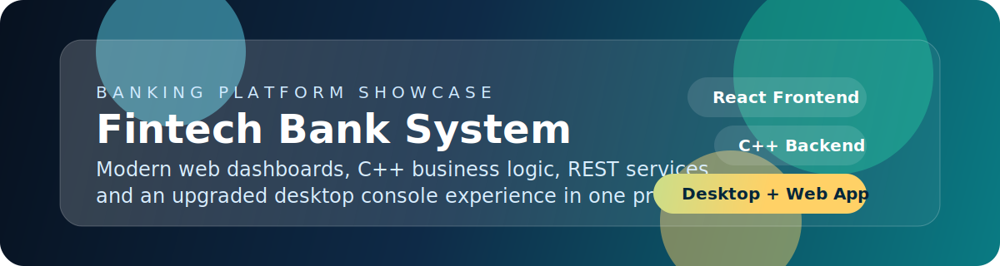
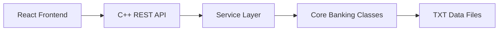

<div align="center">
  
</div>

<br />

<div align="center">
  <a href="https://mohamedessam18.github.io/BankSystem/">
    
  </a>
  
  
</div>

<div align="center">
  Live demo: <a href="https://mohamedessam18.github.io/BankSystem/">https://mohamedessam18.github.io/BankSystem/</a>
</div>

<br />

<div align="center">


</div>

<br />

<div align="center">

| Experience | Delivery |
| --- | --- |
| Role-based dashboards for `client`, `employee`, `admin`, and `manager` | React frontend + C++ backend + original desktop project |
| Banking operations: deposit, withdraw, transfer, balance, people management | TXT persistence, local builds, and GitHub Pages-ready frontend |

</div>

---

## Overview

Fintech Bank System began as a C++ banking project and evolved into a full showcase application with:

- a premium React frontend
- a C++ REST API layer
- an original desktop-style banking core
- role-based product behavior across multiple user types
- lightweight TXT-file persistence for simple local setup

This makes the project useful both as a learning project and as a portfolio piece that demonstrates systems programming, backend logic, and UI product work in one repository.

If you want to try the web app directly, the frontend is already deployed here:

- `https://mohamedessam18.github.io/BankSystem/`

## Highlights

<table>
  <tr>
    <td width="50%" valign="top">
      <h3>Modern Product Feel</h3>
      <p>Animated fintech-inspired screens built with React, Tailwind CSS, and Framer Motion.</p>
    </td>
    <td width="50%" valign="top">
      <h3>Strong C++ Core</h3>
      <p>Business rules, validation, role flows, and persistence are implemented in C++.</p>
    </td>
  </tr>
  <tr>
    <td width="50%" valign="top">
      <h3>Multi-Role System</h3>
      <p>Dedicated experiences for clients, employees, admins, and managers.</p>
    </td>
    <td width="50%" valign="top">
      <h3>Two Faces of the Project</h3>
      <p>The repository includes both the web app and the original Visual Studio console project.</p>
    </td>
  </tr>
</table>

## Showcase

<table>
  <tr>
    <td width="50%" valign="top" align="center">
      
      <br />
      <strong>Authentication</strong>
      <br />
      Clean login and signup flow with a modern fintech direction.
    </td>
    <td width="50%" valign="top" align="center">
      
      <br />
      <strong>Client Workspace</strong>
      <br />
      Personal dashboard for balance, transfers, and account actions.
    </td>
  </tr>
  <tr>
    <td width="50%" valign="top" align="center">
      
      <br />
      <strong>Employee Tools</strong>
      <br />
      Search, view, add, and update clients from one workspace.
    </td>
    <td width="50%" valign="top" align="center">
      
      <br />
      <strong>Admin Controls</strong>
      <br />
      Higher-level control over clients, employees, and administration tasks.
    </td>
  </tr>
</table>

<details>
  <summary><strong>Open the full screenshot gallery</strong></summary>
  <br />
  <p align="center">
    
    
  </p>
  <p align="center">
    
    
  </p>
  <p align="center">
    
    
  </p>
  <p align="center">
    
    
  </p>
  <p align="center">
    
    
  </p>
</details>

## Feature Map

<div align="center">

| Area | Included |
| --- | --- |
| Auth | Login, signup, protected role access |
| Client | Balance, deposit, withdraw, transfer, password update |
| Employee | Add, search, list, and edit clients |
| Admin | Client and employee management |
| Manager | Oversight metrics, admin control, executive tools |

</div>

### Authentication

- Login flow for existing users
- Signup flow for new client accounts
- Role-based redirect after authentication

### Client

- Check current balance
- Deposit funds
- Withdraw funds
- Transfer funds to another client
- Access a transaction-focused dashboard
- Update account password

### Employee

- Add clients
- Search clients
- List all clients
- Edit existing client information
- Update employee password

### Admin

- Add clients
- Search clients
- Edit clients
- Add employees
- Search employees
- Edit employees
- Access administrative summary and control screens

### Manager

- View oversight metrics
- Manage admins
- Access executive operations tools
- Intervene in account actions through higher-level controls

## Why It Stands Out

| Area | Value |
| --- | --- |
| C++ business layer | Demonstrates object-oriented design, validations, and file-based persistence |
| Frontend quality | Delivers a more premium UI than a typical academic CRUD app |
| Architecture | Connects a React frontend to a C++ HTTP API while preserving existing core logic |
| Scope | Covers auth, role-based access, banking operations, and people management |
| Portfolio strength | Shows both low-level and product-facing engineering in one project |

## Architecture



## Tech Stack

### Frontend

- React
- Vite
- Tailwind CSS
- Framer Motion
- Axios
- React Router

### Backend

- C++17
- CMake
- `cpp-httplib`
- `nlohmann/json`

### Desktop Project

- Visual Studio solution
- Colored console UI
- Shared banking core classes

### Storage

- Plain text files in `backend/data/`

## Project Structure

```text
.
|-- assets/
|-- backend/
|   |-- controllers/
|   |-- core/
|   |-- data/
|   |-- routes/
|   |-- services/
|   |-- vendor/
|   |-- CMakeLists.txt
|   `-- main.cpp
|-- frontend/
|   |-- public/
|   |-- src/
|   |   |-- components/
|   |   |-- context/
|   |   |-- hooks/
|   |   |-- layouts/
|   |   |-- pages/
|   |   |-- services/
|   |   `-- styles/
|   |-- package.json
|   `-- vite.config.js
|-- Bank System/
|-- Bank System.sln
`-- README.md
```

## Quick Start

### 1. Run the backend

From the repository root:

```powershell
cmake -S backend -B backend/build
cmake --build backend/build --config Release
.\backend\build\Release\bank_server.exe
```

Backend default URL:

```text
http://localhost:8080
```

### 2. Run the frontend

```powershell
cd frontend
npm install
npm run dev
```

Frontend default URL:

```text
http://localhost:5173
```

### 3. Build the frontend

```powershell
cd frontend
npm run build
```

### 4. Run the original C++ desktop project

Open `Bank System.sln` in Visual Studio Community and run the `Debug | x64` configuration.

## Deployment

### Frontend

The frontend is already prepared for GitHub Pages deployment.

Live deployed frontend:

- `https://mohamedessam18.github.io/BankSystem/`

What is included:

- `HashRouter` support in production
- relative asset paths
- GitHub Actions workflow for deployment

Required GitHub variable:

```text
VITE_API_BASE_URL=https://your-backend-url
```

Production URL format:

```text
https://<your-github-username>.github.io/<your-repository-name>/
```

### Backend

The backend should be deployed separately on a service such as Render or Railway.

Useful files already included:

- `backend/Dockerfile`
- `backend/.dockerignore`
- `PORT` environment variable support in `backend/main.cpp`

Health-check example:

```text
https://your-backend-url/health
```

## API Summary

### Authentication

- `POST /login`
- `POST /signup`

### Client

- `GET /client/{id}/balance`
- `POST /client/{id}/deposit`
- `POST /client/{id}/withdraw`
- `POST /client/transfer`

### Employee

- `POST /employee/add-client`
- `GET /employee/clients`
- `GET /employee/client/{id}`
- `PUT /employee/client/{id}`

### Admin

- `POST /admin/add-employee`
- `GET /admin/employees`
- `PUT /admin/employee/{id}`

### Manager

- `GET /manager/overview`
- `GET /manager/admins`
- `POST /manager/add-admin`
- `PUT /manager/admin/{id}`

### Response Shape

```json
{
  "status": "success",
  "message": "Operation completed successfully",
  "data": {}
}
```

## Sample Credentials

Seeded TXT files currently include:

- Admin: `1 / adminPass456`
- Employee: `1 / mohamedes8`
- Client: `1 / sama12321`

## Validation Rules

- Client minimum balance: `1500`
- Employee minimum salary: `5000`
- Name length: `3-20` alphabetic characters
- Password length: `8-20` characters with no spaces

## Team Credits

This project was delivered as the **Final Project** for the **Programming Fundamentals Diploma Using C++** at **Route**.

### Core Team

- **Mohamed Essam** - Team Leader
- **Mohamed Khalaf**
- **Mahmoud Salah**
- **Kareem Mohamed**
- **Hassan Tarek**
- **Hager**

### Academic Support

- **Instructor:** Basma Ali
- **Mentor:** Sama Osama

## Notes

- Screenshots are stored in `assets/`
- The backend uses TXT files instead of a database server
- The desktop Visual Studio project is still included for the original C++ experience

---

<div align="center">
  <strong>Built as a banking system project with both systems-level logic and a polished modern interface.</strong>
</div>
