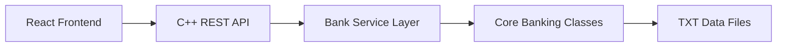
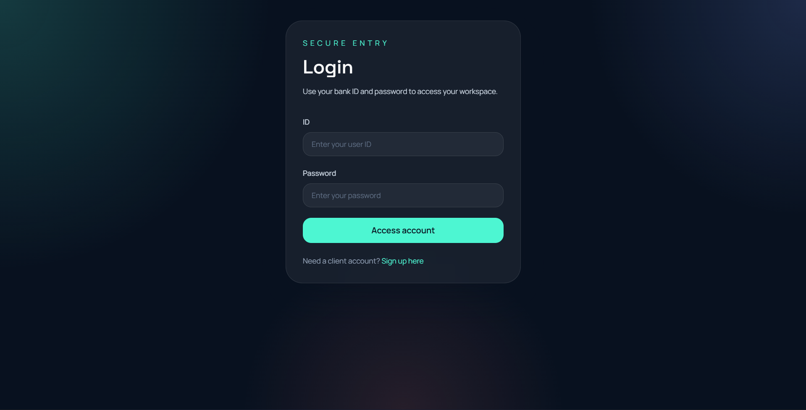
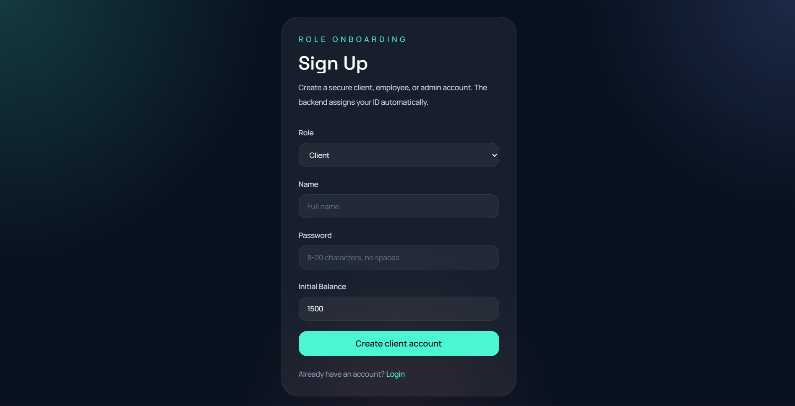
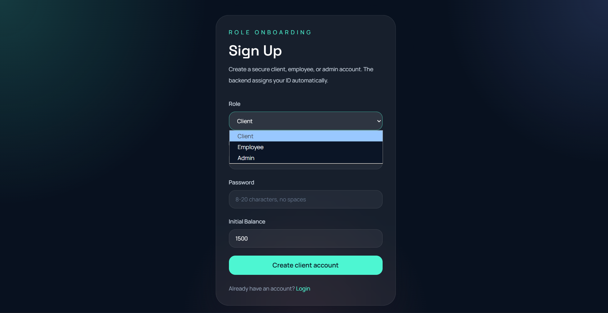

# <div align="center">Fintech Bank System</div>

<div align="center">
  A full-stack banking project that combines a modern React frontend, a C++ REST backend, and the original desktop-style banking core.
</div>

<br />

<div align="center">


</div>

---

## Overview

This repository started as a C++ banking system and now includes a polished web application on top of that core logic.

It covers:

- Secure login and signup flows
- Role-based dashboards for `client`, `employee`, `admin`, and `manager`
- Banking actions like deposit, withdraw, transfer, and balance lookup
- Employee, admin, and oversight management tools
- TXT-file persistence for lightweight local storage
- A modern fintech-style interface built for the browser

## Team Credits

This project was delivered as the **Final Project** for the **Programming Fundamentals Diploma Using C++** at **Route**.

It was built collaboratively by a team of 6 members, with the project tasks distributed across the team throughout planning, implementation, and delivery.

### Core Team

- **Mohamed Essam** — Team Leader
- **Mohamed Khalaf**
- **Mahmoud Salah**
- **Kareem Mohamed**
- **Hassan Tarek**
- **Hager**

### Academic Support

- **Instructor:** Basma Ali
- **Mentor:** Sama Osama

## Why This Project Stands Out

| Area | What makes it interesting |
| --- | --- |
| Core logic | Banking rules are implemented in C++ with validations and role-based behavior |
| Web experience | The frontend uses React, Tailwind CSS, and Framer Motion for a premium dashboard feel |
| Architecture | The original desktop-oriented model is reused through a C++ HTTP API |
| Practical scope | Authentication, CRUD-style admin tools, transactions, and data persistence are all included |
| Portfolio value | It shows both systems programming and product-style frontend work in one repo |

## Tech Stack

### Frontend

- React
- Vite
- Tailwind CSS
- Framer Motion
- Axios
- React Router

### Backend

- C++17
- CMake
- `cpp-httplib`
- `nlohmann/json`

### Data Storage

- Plain text files in `backend/data/`

## Architecture



## Project Structure

```text
.
|-- assets/
|-- backend/
|   |-- controllers/
|   |-- core/
|   |-- data/
|   |-- routes/
|   |-- services/
|   |-- vendor/
|   |-- CMakeLists.txt
|   `-- main.cpp
|-- frontend/
|   |-- public/
|   |-- src/
|   |   |-- components/
|   |   |-- context/
|   |   |-- hooks/
|   |   |-- layouts/
|   |   |-- pages/
|   |   |-- services/
|   |   `-- styles/
|   |-- package.json
|   `-- vite.config.js
|-- Bank System.sln
`-- README.md
```

## Feature Highlights

### Authentication

- Responsive login page for existing users
- Signup flow for creating new client accounts
- Protected role-based routing after sign-in

### Client

- Log in to a personal dashboard
- Check current balance
- Deposit funds
- Withdraw funds
- Transfer funds to another client
- Use a dedicated transactions workspace for daily account actions

### Employee

- Employee dashboard for client operations
- Add new clients
- View client records
- Search client data
- Update existing client details

### Admin

- Administrative dashboard with search and summary views
- Manage employees
- Manage clients
- Update employee records
- Access a dedicated security and governance view

### Manager

- View high-level bank overview metrics
- Control people records across clients, employees, and admins
- Add and update admin accounts
- Use executive tools for deposit, withdraw, and transfer intervention workflows

## Screenshots

All current screenshots are stored in `assets/` and named by feature for easier maintenance.

### Authentication

<p align="center">
  
  
</p>

<p align="center">
  
</p>

### Client Dashboard

<p align="center">
  
  
</p>

### Employee Dashboard

<p align="center">
  
  
</p>

<p align="center">
  
</p>

### Admin Dashboard

<p align="center">
  
  
</p>

<p align="center">
  
  
</p>

<p align="center">
  
  
</p>

## Quick Start

### 1. Run the backend

From the repository root:

```powershell
cmake -S backend -B backend/build
cmake --build backend/build --config Release
.\backend\build\Release\bank_server.exe
```

Backend default URL:

```text
http://localhost:8080
```

The backend also supports a hosted `PORT` environment variable, so it can run on cloud platforms that assign the port automatically.

### 2. Run the frontend

```powershell
cd frontend
npm install
npm run dev
```

Frontend default URL:

```text
http://localhost:5173
```

### 3. Build the frontend for production

```powershell
cd frontend
npm run build
```

## Deploy Frontend to GitHub Pages

The frontend is configured to deploy automatically from GitHub Actions to GitHub Pages.

### What is already set up

- GitHub Pages-safe routing via `HashRouter` in production
- Relative Vite asset paths for repository-based hosting
- A workflow at `.github/workflows/deploy-frontend.yml` that builds `frontend/` and publishes `frontend/dist`

### GitHub setup steps

1. Push this repository to GitHub.
2. In GitHub, open **Settings -> Pages**.
3. Under **Source**, select **GitHub Actions**.
4. In **Settings -> Secrets and variables -> Actions -> Variables**, add:

```text
VITE_API_BASE_URL=https://your-backend-url
```

If you do not set `VITE_API_BASE_URL`, the production build will fall back to:

```text
http://localhost:8080
```

That fallback is useful for local development, but it will not work for a live GitHub Pages site unless your backend is also publicly hosted.

### After deployment

Your frontend will be available at:

```text
https://<your-github-username>.github.io/<your-repository-name>/
```

## Deploy Backend

GitHub Pages only hosts the frontend, so the C++ API must be deployed separately.

### Recommended path

Deploy the `backend/` folder as a Docker service on a host like Render or Railway.

### Files already added for deployment

- `backend/Dockerfile`
- `backend/.dockerignore`
- support for the host-provided `PORT` environment variable in `backend/main.cpp`

### Render example

1. Push the repository to GitHub.
2. In Render, create a new **Web Service** from the repository.
3. Set the **Root Directory** to:

```text
backend
```

4. Choose **Docker** as the environment.
5. Deploy the service.
6. After deployment, copy the public backend URL. It will look similar to:

```text
https://bank-system-api.onrender.com
```

7. In GitHub repository settings, set:

```text
VITE_API_BASE_URL=https://bank-system-api.onrender.com
```

### Test the deployed backend

Open:

```text
https://your-backend-url/health
```

If deployment is working, it should return a JSON success response.

## API Summary

### Authentication

- `POST /login`
- `POST /signup`

### Client

- `GET /client/{id}/balance`
- `POST /client/{id}/deposit`
- `POST /client/{id}/withdraw`
- `POST /client/transfer`

### Employee

- `POST /employee/add-client`
- `GET /employee/clients`
- `GET /employee/client/{id}`
- `PUT /employee/client/{id}`

### Admin

- `POST /admin/add-employee`
- `GET /admin/employees`
- `PUT /admin/employee/{id}`

### Manager

- `GET /manager/overview`
- `GET /manager/admins`
- `POST /manager/add-admin`
- `PUT /manager/admin/{id}`

### Response Shape

```json
{
  "status": "success",
  "message": "Operation completed successfully",
  "data": {}
}
```

## Sample Credentials

The seeded TXT files in `backend/data/` currently include example accounts:

- Admin: `1 / adminPass456`
- Employee: `1 / mohamedes8`
- Client: `1 / sama12321`

## Legacy Visual Studio Project

The repository also still contains the original Visual Studio solution:

- `Bank System.sln`

This is useful if you want to explore or run the original C++ project directly outside the web app flow.

## Validation Rules

- Client minimum balance: `1500`
- Employee minimum salary: `5000`
- Name length: `3-20` alphabetic characters
- Password length: `8-20` characters with no spaces

## Build Notes

- Frontend production build was previously verified successfully in this workspace
- Backend build depends on a local C++ toolchain and CMake
- The backend stores data in TXT files rather than a database server

## Recommended Next Improvements

If you want to keep strengthening this project page, useful next upgrades are:

1. Add screenshots for the manager dashboard and executive tools.
2. Add deployment links for the frontend and backend.
3. Add a license section.
4. Add contributors or a roadmap section.

## Author Notes

This project is a strong showcase piece because it bridges:

- object-oriented C++ design
- REST API integration
- role-based product behavior
- modern UI styling for a financial dashboard

---

<div align="center">
  Built as a banking system project with both systems-level logic and a modern web experience.
</div>
