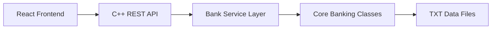

# <div align="center">Fintech Bank System</div>

<div align="center">
  A full-stack banking project that combines a modern React frontend, a C++ REST backend, and the original desktop-style banking core.
</div>

<br />

<div align="center">


</div>

---

## Overview

This repository started as a C++ banking system and now includes a polished web application on top of that core logic.

It covers:

- Secure login and signup flows
- Role-based dashboards for `client`, `employee`, and `admin`
- Banking actions like deposit, withdraw, transfer, and balance lookup
- Employee and admin management tools
- TXT-file persistence for lightweight local storage
- A modern fintech-style interface built for the browser

## Why This Project Stands Out

| Area | What makes it interesting |
| --- | --- |
| Core logic | Banking rules are implemented in C++ with validations and role-based behavior |
| Web experience | The frontend uses React, Tailwind CSS, and Framer Motion for a premium dashboard feel |
| Architecture | The original desktop-oriented model is reused through a C++ HTTP API |
| Practical scope | Authentication, CRUD-style admin tools, transactions, and data persistence are all included |
| Portfolio value | It shows both systems programming and product-style frontend work in one repo |

## Tech Stack

### Frontend

- React
- Vite
- Tailwind CSS
- Framer Motion
- Axios
- React Router

### Backend

- C++17
- CMake
- `cpp-httplib`
- `nlohmann/json`

### Data Storage

- Plain text files in `backend/data/`

## Architecture



## Project Structure

```text
.
|-- backend/
|   |-- controllers/
|   |-- core/
|   |-- data/
|   |-- routes/
|   |-- services/
|   |-- vendor/
|   |-- CMakeLists.txt
|   `-- main.cpp
|-- frontend/
|   |-- public/
|   |-- src/
|   |   |-- components/
|   |   |-- context/
|   |   |-- hooks/
|   |   |-- layouts/
|   |   |-- pages/
|   |   |-- services/
|   |   `-- styles/
|   |-- package.json
|   `-- vite.config.js
|-- Bank System.sln
`-- README_WEBAPP.md
```

## Feature Highlights

### Client

- Log in to a personal dashboard
- Check current balance
- Deposit funds
- Withdraw funds
- Transfer funds to another client

### Employee

- Add new clients
- View client records
- Search client data
- Update existing client details

### Admin

- Manage employees
- Manage clients
- Access administrative dashboard tools
- Update employee records

## Quick Start

### 1. Run the backend

From the repository root:

```powershell
cmake -S backend -B backend/build
cmake --build backend/build --config Release
.\backend\build\Release\bank_server.exe
```

Backend default URL:

```text
http://localhost:8080
```

### 2. Run the frontend

```powershell
cd frontend
npm install
npm run dev
```

Frontend default URL:

```text
http://localhost:5173
```

### 3. Build the frontend for production

```powershell
cd frontend
npm run build
```

## API Summary

### Authentication

- `POST /login`
- `POST /signup`

### Client

- `GET /client/{id}/balance`
- `POST /client/{id}/deposit`
- `POST /client/{id}/withdraw`
- `POST /client/transfer`

### Employee

- `POST /employee/add-client`
- `GET /employee/clients`
- `GET /employee/client/{id}`
- `PUT /employee/client/{id}`

### Admin

- `POST /admin/add-employee`
- `GET /admin/employees`
- `PUT /admin/employee/{id}`

### Response Shape

```json
{
  "status": "success",
  "message": "Operation completed successfully",
  "data": {}
}
```

## Sample Credentials

The seeded TXT files in `backend/data/` currently include example accounts:

- Admin: `1 / adminPass456`
- Employee: `1 / mohamedes8`
- Client: `1 / sama12321`

## Legacy Visual Studio Project

The repository also still contains the original Visual Studio solution:

- `Bank System.sln`

This is useful if you want to explore or run the original C++ project directly outside the web app flow.

## Validation Rules

- Client minimum balance: `1500`
- Employee minimum salary: `5000`
- Name length: `3-20` alphabetic characters
- Password length: `8-20` characters with no spaces

## Build Notes

- Frontend production build was previously verified successfully in this workspace
- Backend build depends on a local C++ toolchain and CMake
- The backend stores data in TXT files rather than a database server

## Recommended README Add-ons

If you want this GitHub page to look even stronger, the next upgrades are:

1. Add screenshots or a short demo GIF of the frontend dashboard.
2. Add deployment links for the frontend and backend.
3. Add a license section.
4. Add contributors and roadmap sections.

## Author Notes

This project is a strong showcase piece because it bridges:

- object-oriented C++ design
- REST API integration
- role-based product behavior
- modern UI styling for a financial dashboard

---

<div align="center">
  Built as a banking system project with both systems-level logic and a modern web experience.
</div>
